<p align="center">
  <a href="#YOUR INTERNET SPEED IS TOO MUCH SLOW">
    
  </a>
</p>

# CropNexus

### AI-Powered Crop Advisory & Leaf Disease Detection — Web + Mobile

<p>
  
  
  
  
  
  
</p>

CropNexus recommends the best crop for a farmer's field, gives fertilizer
and irrigation guidance, and detects leaf diseases from a photo — with a
secure login system and support for English, Bengali and Hindi, on both a
responsive web app and a native Expo mobile app.

</div>

---

## 📋 Table of Contents

- [Overview](#-overview)
- [Features](#-features)
- [Technologies Used](#-technologies-used)
- [Screenshots](#-screenshots)
- [Demo Video](#-demo-video)
- [Project Structure](#-project-structure)
- [MongoDB Configuration](#-mongodb-configuration)
- [Backend / API Setup](#-backend--api-setup)
- [Web App](#-web-app)
- [Mobile App (Expo)](#-mobile-app-expo)
- [Architecture](#architecture)
- [Authentication & Security](#-authentication--security)
- [Multilingual Support](#-multilingual-support)
- [Retraining the Models](#-retraining-the-models)
- [Honest Limitations](#-honest-limitations)
- [Troubleshooting](#-troubleshooting)

---

## 🔭 Overview

CropNexus is a full-stack AI/ML project built around two trained models:

1. **Crop recommendation** — a tuned Random Forest, trained on 2,200 records across 22 crops, reaching **99.32% test accuracy**.
2. **Leaf disease detection** — a compact CNN trained from scratch on ~2,400 real PlantVillage photos across 10 classes (5 crops × disease/healthy), reaching **91.96% test accuracy**.

Both are served from one Flask backend, with **MongoDB-backed authentication**
(bcrypt-hashed passwords, JWT sessions) gating access, and the same features
available on a **responsive web app** and a **native Expo mobile app** — in
**English, Bengali, and Hindi**.

## ✨ Features

| Feature | Description |
|---|---|
| 🔐 **Secure Auth** | Email/password sign up & login, bcrypt-hashed passwords in MongoDB, JWT sessions |
| 🛡️ **Protected App** | The dashboard, advisory, leaf scan, history and model pages all require login |
| 🌾 **Crop Advisory** | Enter soil N-P-K, pH, temperature, humidity, rainfall, location → top-3 recommended crops with confidence scores |
| 🧪 **Fertilizer Guidance** | Your soil's N-P-K compared against the ideal range for the recommended crop |
| 💧 **Irrigation Plan** | Rainfall/humidity-based watering frequency |
| 🍃 **Leaf Disease Detection** | Upload/photograph a leaf → CNN identifies the disease (or confirms healthy) + symptoms + a curing plan |
| 📊 **Model Transparency** | A full comparison of every model tried, hyperparameter tuning results, and feature importance |
| 📜 **Advisory History** | Every request is saved and browsable later |
| 🌗 **Light / Dark Mode** | On both web and mobile, persisted per device |
| 🌐 **Multilingual** | English, Bengali (বাংলা) and Hindi (हिन्दी), switchable from the main interface on both web and mobile |
| 📱 **Native Mobile App** | Built with Expo Router — runs instantly via Expo Go, no native build required |

## 🛠️ Technologies Used

**Backend**
- Python, Flask, Flask-CORS
- MongoDB (via `pymongo`) for user accounts
- `bcrypt` for password hashing, `PyJWT` for session tokens
- scikit-learn, XGBoost (crop model) · TensorFlow/Keras (leaf disease CNN)
- pandas, NumPy, joblib

**Web Frontend**
- Server-rendered Jinja2 templates, vanilla CSS/JS (no framework)
- Custom i18n (English/Bengali/Hindi) via a Flask context processor

**Mobile App**
- React Native + Expo (SDK 57), Expo Router (file-based navigation)
- TypeScript throughout
- `expo-secure-store` (JWT token storage), `expo-image-picker`, `expo-file-system` (native multipart upload)
- `@react-native-async-storage/async-storage` (theme/language persistence)

---

## 📸 Screenshots

> Run the app and drop your screenshots into `screenshots/` using the exact
> filenames below (see `screenshots/README.md` for the full list and what
> to capture) — they'll then render automatically in this section.

| | |
|---|---|
| **Landing Page** <br> 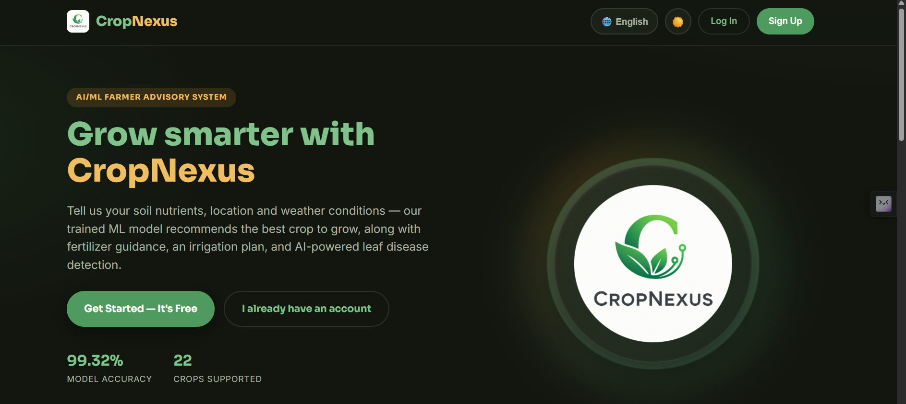 | **Login** <br> 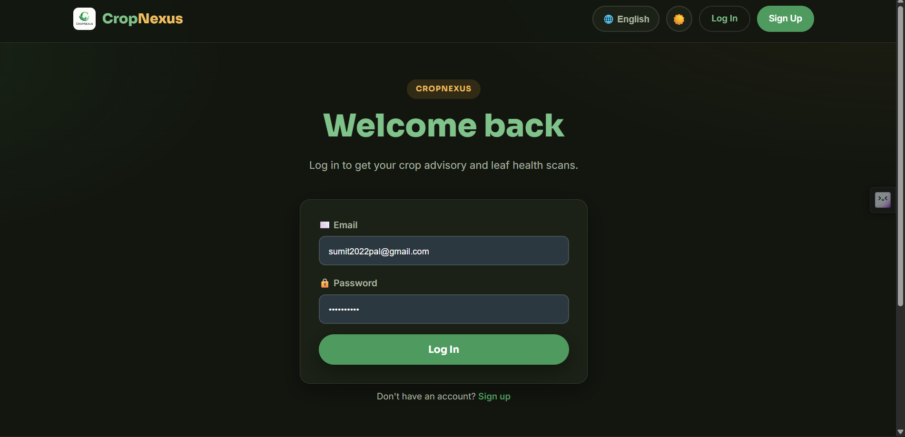 |
| **Sign Up** <br> 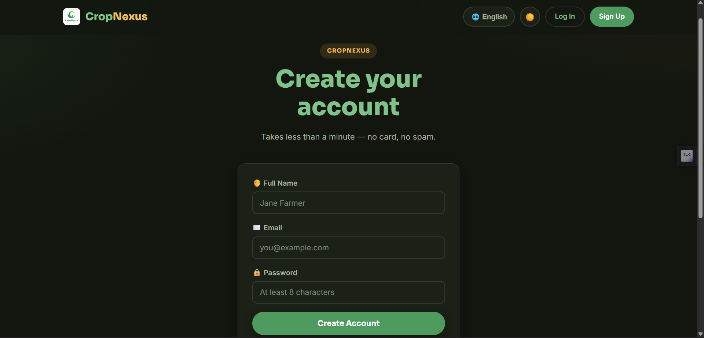 | **Home Dashboard** <br> 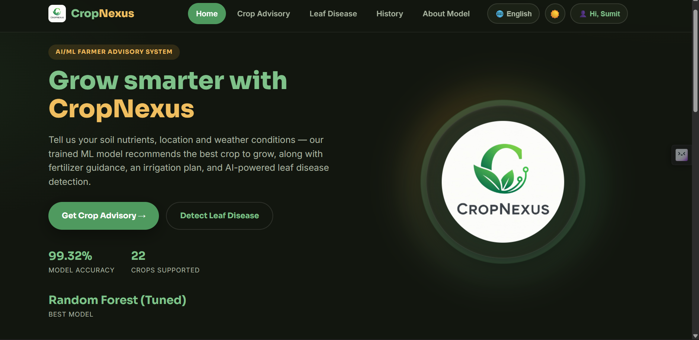 |
| **Crop Advisory — Form** <br> 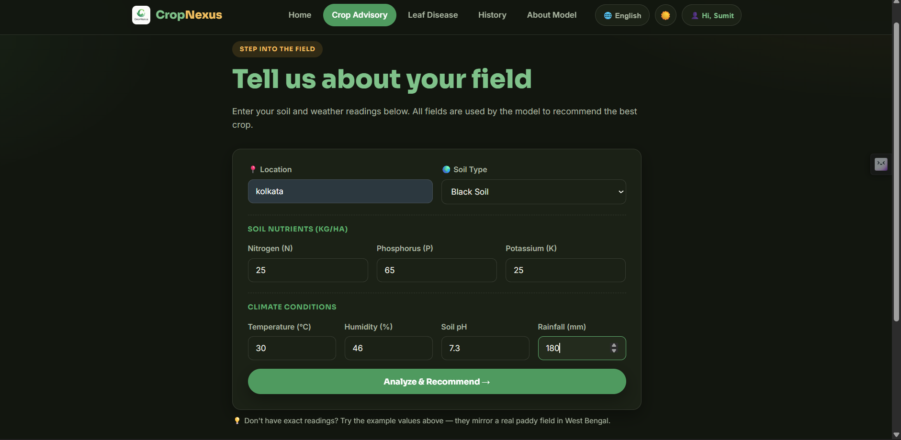 | **Crop Advisory — Result** <br> 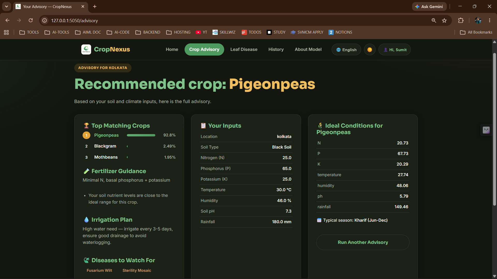 |
| **Leaf Disease Detection** <br> 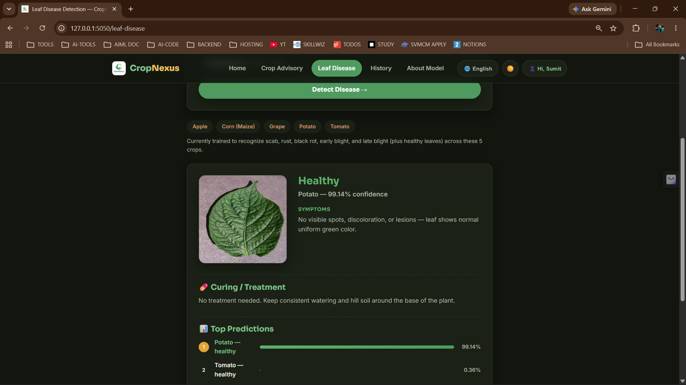 | **Advisory History** <br> 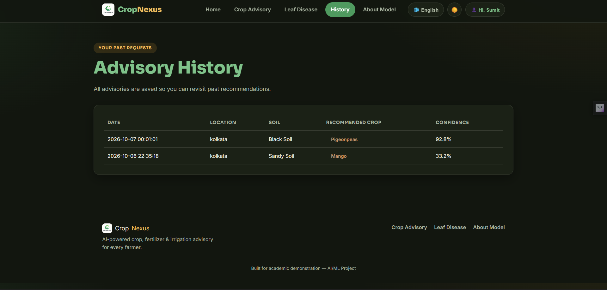 |
| **About the Models** <br> 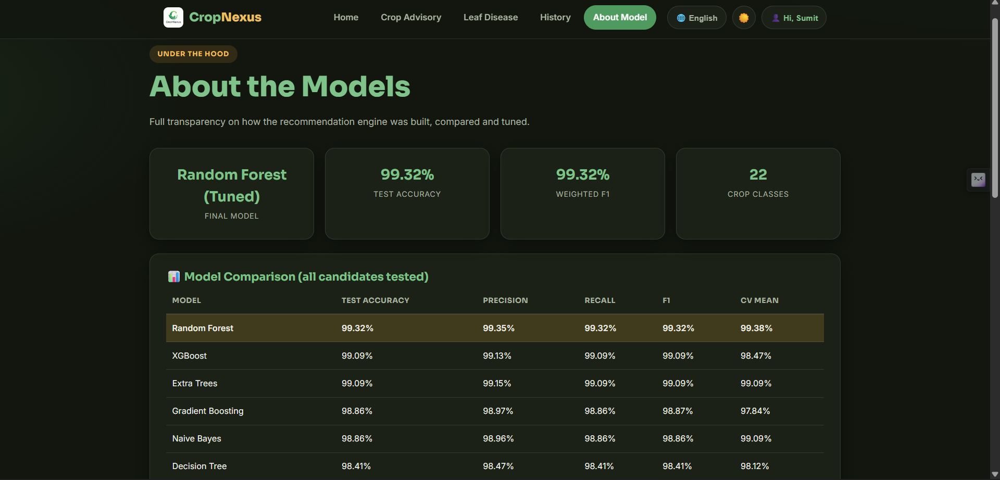 | **Language Selector** <br> 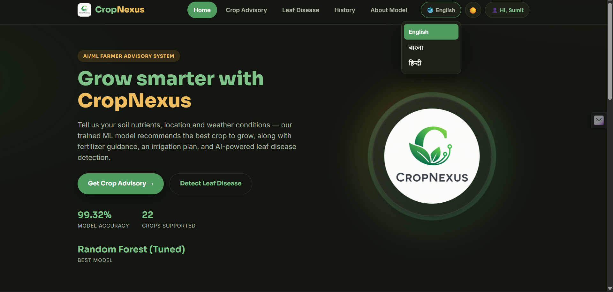 |
| **Mobile — Home** <br> 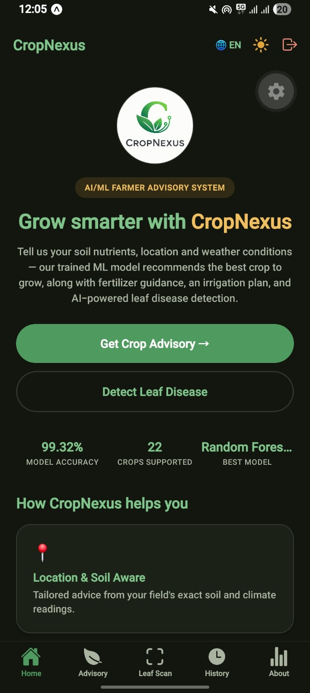 | **Mobile — Leaf Disease** <br> 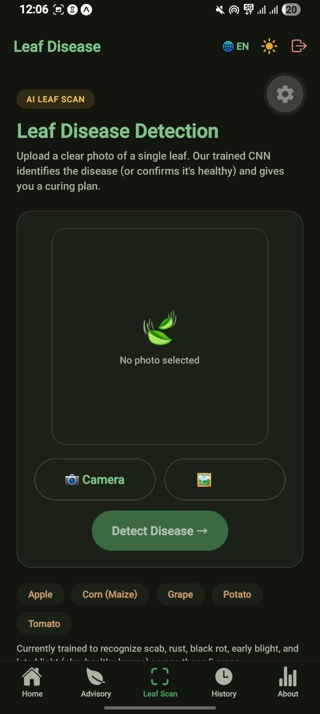 |

## 🎥 Demo Video

> **[Add your demo video link here]** — e.g. a YouTube/Drive link showing
> sign up → login → crop advisory → leaf disease detection → language
> switch, on both web and mobile.

---

## 🗂️ Project Structure

```
CropNexus/
├── app/                                # Flask backend + web frontend
│   ├── app.py                           # Routes: web pages + JSON API
│   ├── auth.py                          # MongoDB users, bcrypt, JWT, decorators
│   ├── i18n.py                          # English/Bengali/Hindi translation dicts
│   ├── leaf_disease_architecture.py     # CNN architecture (shared with training)
│   ├── model/                           # Crop model + leaf disease model artifacts
│   ├── database/                        # JSON "content" store (crop info, disease info, advisory history)
│   ├── static/{css,js,img}/
│   ├── templates/                       # landing, login, signup, home, advisory, leaf_disease, history, about
│   └── uploads/                         # uploaded leaf photos (runtime)
├── mobile/                              # React Native (Expo) app — see mobile/README.md
│   ├── app/                              # Expo Router screens (login, signup, tabs)
│   ├── src/auth/                         # AuthContext, token storage
│   ├── src/i18n/                         # LanguageContext, translations
│   ├── src/theme/                        # ThemeContext (light/dark)
│   ├── src/api/                          # API client
│   └── src/components/
├── notebooks/                           # Jupyter notebooks (crop model + leaf disease CNN training)
├── notebooks_py/                        # Same notebooks as plain .py scripts
├── data/                                # Training datasets
├── models/                              # Canonical trained model artifacts + metrics
├── screenshots/                         # Drop your screenshots here (see screenshots/README.md)
├── train_pipeline.py                    # Crop model training (source of truth)
├── train_leaf_disease_model.py          # Leaf disease CNN training (resumable)
├── finalize_leaf_disease_model.py       # Evaluates + saves the final leaf disease model
├── requirements.txt
├── .env.example                         # MongoDB + secret key configuration template
└── README.md
```

---

## 🍃 MongoDB Configuration

CropNexus stores user accounts in MongoDB — nothing else (crop/leaf disease
data stays in the JSON files under `app/database/`, no DB needed for those).

1. Install and run MongoDB locally (or use MongoDB Atlas / another host).
   The default setup matches a local **MongoDB Compass** connection at
   `localhost:27017`, with database **`CROPNEXUS`** and collection **`USERS`**.
2. Copy `.env.example` to `.env` in the project root and set:

   ```dotenv
   MONGO_URI=mongodb://localhost:000000/CROPNEXUS
   MONGO_USERS_COLLECTION=USERS
   ```

3. That's it — the app creates a unique index on `email` automatically on
   first run, so duplicate sign-ups are rejected at the database level, not
   just in application code.

If MongoDB isn't reachable, the backend still starts (crop advisory and
leaf disease detection work independently of auth), but sign up/login will
return a clear "couldn't reach the database" error until MongoDB is up.

---

## ⚙️ Backend / API Setup

```bash
python -m venv venv
source venv/bin/activate      
pip install -r requirements.txt
cp .env.example .env           
cd app
python app.py
```

The server starts on `http://0.0.0.0:5050` (reachable as
`http://localhost:5050` from your computer, or `http://<your-LAN-IP>:5050`
from your phone for the mobile app).

### Key API routes

| Method | Route | Purpose | Auth |
|---|---|---|---|
| POST | `/api/auth/signup` | Create an account, returns a JWT | — |
| POST | `/api/auth/login` | Log in, returns a JWT | — |
| GET | `/api/auth/me` | Verify a token, returns the current user | Bearer token |
| POST | `/api/advisory` | Full crop advisory (JSON) | Bearer token |
| POST | `/api/leaf-disease` | Leaf disease detection (multipart image upload) | Bearer token |
| GET | `/api/history` | Advisory history (JSON) | Bearer token |
| GET | `/api/model-info` | Both models' metrics (JSON) | Bearer token |

The web app uses the same auth logic through session-rendered pages
(`/login`, `/signup`, `/logout`) rather than calling these JSON routes
directly.

---

## 🌐 Web App

The web app is the Flask app itself — once `python app.py` is running,
open `http://localhost:5050`. Unauthenticated visitors see the **landing
page** with Login/Sign Up buttons in the top corner; after logging in, the
full app (Home, Crop Advisory, Leaf Disease, History, About Model) becomes
available, with a language switcher and dark-mode toggle in the nav bar.

---

## 📱 Mobile App (Expo)

```bash
cd mobile
npm install
cp .env.example .env    
npx expo start
```

This prints a **QR code** in the terminal. Scan it with the **Expo Go** app
([iOS](https://apps.apple.com/app/expo-go/id982107779) /
[Android](https://play.google.com/store/apps/details?id=host.exp.exponent))
on a phone connected to the **same Wi-Fi** as your computer. The app opens
with a login screen — sign up or log in (same MongoDB-backed accounts as
the web app — one account works on both), then the same 5 tabs (Home,
Advisory, Leaf Scan, History, About) appear, with a language cycle button
and theme toggle in the header.

Full setup detail, every dependency and exact install command, and
troubleshooting live in **[`mobile/README.md`](mobile/README.md)**.

---
## Architecture

### [View Architecture Diagram on Eraser](https://app.eraser.io/workspace/3SLBkUA8KYQU62iT6eSV)
--
## 🔐 Authentication & Security

- **Passwords** are hashed with `bcrypt` (cost factor 12) before ever
  touching the database — plaintext passwords are never stored or logged.
- **Sessions** use signed JWTs (`PyJWT`), carried as an httpOnly cookie for
  the web app and a `Bearer` header (stored via `expo-secure-store`, the
  OS keychain/keystore) for the mobile app.
- **Duplicate accounts** are rejected both in application code and by a
  unique MongoDB index on `email`.
- **Protected routes**: every feature page/route (web and API) requires a
  valid session — `@auth.login_required` for web pages,
  `@auth.api_login_required` for JSON API routes — unauthenticated requests
  are redirected to `/login` (web) or receive a `401 Unauthorized` (API).
- **Secrets**: `SECRET_KEY` (Flask session signing) and `JWT_SECRET` (token
  signing) are read from `.env`, never hardcoded for production use — see
  `.env.example`.

---

## 🌐 Multilingual Support

CropNexus ships with **English, Bengali (বাংলা), and Hindi (हिन्दी)**,
switchable from a language selector in the main navigation on both web and
mobile, with the choice persisted per device/session.

- **Web**: `app/i18n.py` holds the translation dictionaries; a Flask
  `context_processor` injects `t` (the current language's strings) and
  `current_lang` into every template. Switch language via the 🌐 selector
  in the nav bar (stored in the session).
- **Mobile**: `mobile/src/i18n/translations.ts` + `LanguageContext.tsx`
  mirror the same keys and languages, persisted with `AsyncStorage`. Tap
  the 🌐 button in the header to cycle languages.

**Scope note:** translated strings cover the UI chrome — navigation,
headings, form labels, buttons, and auth screens. Dynamic content returned
by the models (crop names, fertilizer guidance text, disease symptoms and
treatment steps) currently stays in English; translating that agronomic
content is a larger content-translation effort distinct from the
language-switching mechanism itself, which is fully built and working.

---

## 🔁 Retraining the Models

**Crop advisory model:**
```bash
python train_pipeline.py
python build_crop_knowledge_base.py
cp models/*.joblib app/model/
```

**Leaf disease model** (resumable — safe to stop and re-run):
```bash
python train_leaf_disease_model.py
python finalize_leaf_disease_model.py
python build_leaf_disease_knowledge_base.py
cp models/leaf_disease/leaf_disease_model.weights.h5 models/leaf_disease/class_names.json app/model/leaf_disease/
```

Full pipeline details, notebooks, and rationale are in `notebooks/` and the
inline comments of each script.

---

## ⚠️ Honest Limitations

- The leaf disease model recognizes **10 classes across 5 crops** (Apple,
  Corn/Maize, Grape, Potato, Tomato), not the full PlantVillage dataset —
  it won't recognize diseases outside these.
- Agronomic content (fertilizer guidance, disease symptoms/treatment) is
  English-only for now — see [Multilingual Support](#-multilingual-support).
- This is a portfolio/academic project — not a certified diagnostic tool.
  For high-stakes decisions, confirm with a local agricultural extension
  officer.

---

## 🩹 Troubleshooting

**"Couldn't reach the database" on sign up/login**
→ MongoDB isn't running, or `MONGO_URI` in `.env` doesn't match your setup.
Confirm MongoDB Compass can connect to the same URI first.

**Mobile app can't reach the server**
→ See the detailed troubleshooting section in `mobile/README.md` — it
covers LAN IP configuration, the Android `fetch`/`FormData` upload bug we
specifically fixed, and more.

**TypeError about Keras/initializer deserialization on leaf disease startup**
→ See the troubleshooting section further down — the app loads the leaf
disease model as weights-only specifically to avoid this class of error
across different TensorFlow/Keras versions.

**Wrong language shows up after switching**
→ Web: language is stored in your Flask session cookie — clear cookies
for the site if it seems stuck. Mobile: stored in `AsyncStorage`; reinstall
the Expo Go session or clear app data if it seems stuck.
